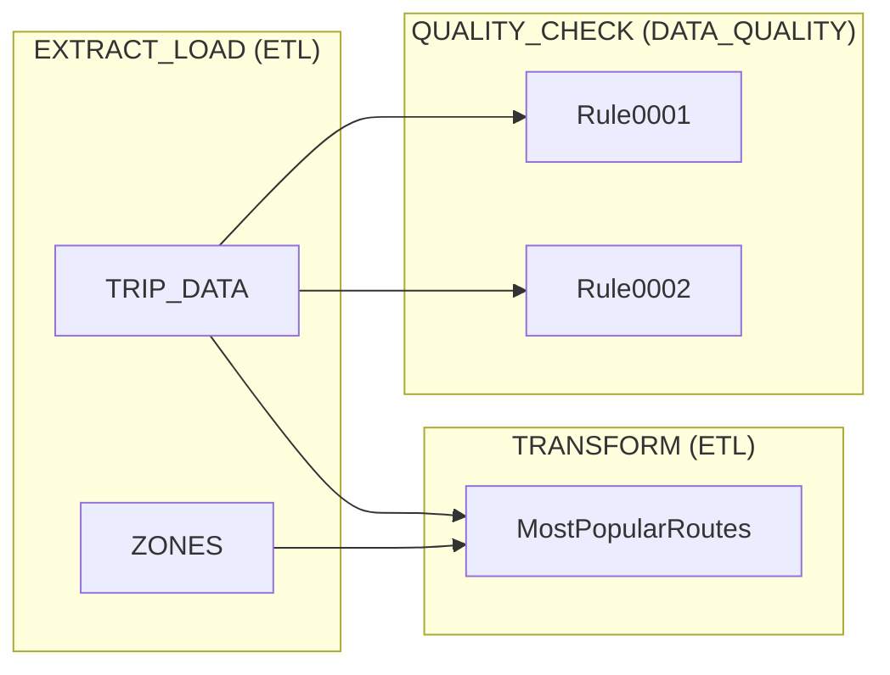

## Visual Workflow

This page explains how parsing an ETL/ELT Markdown configuration produces structured metadata used to build a graph representation of the workflow and a Mermaid flowchart visualization.

**How it works**
- **Parse config:** The parser reads the Markdown frontmatter and sections of a config file and emits a `workflow` object.
- **Generate nodes:** Each top-level section and relevant subsections become graph nodes (process, subprocess, checks, etc.).
- **Generate edges:** For every `depends_on` value like `section.key` (e.g. `extract_load.trip_data`), the parser emits an edge from the dependent node to the referenced node.
- **If no depends_on key is found:** If the markdown file does not contain a `depends_on` key, it is estimated based on the relations found in the sql inside the sections, but this can be wrong if the names are not unique.
- **Mermaid flowchart:** The generated nodes and edges are emitted, and as a Mermaid `flowchart` with it is dumped in the temp folder.

**Example: Mermaid Flowchart**

Example frontmatter and an automatically-produced Mermaid flowchart for a simple ETL workflow.

````markdown
---
config:
  look: handDrawn
  theme: neutral
---


````

That Renders to:


Notes:
- Node IDs are constructed from section paths (e.g. `extract_load.trip_data` -> `extract_load_trip_data`).
- Edges are created whenever a config entry lists `depends_on` with a dotted path. The left part of the path shows the process level and the right part the resource or subprocess.

**Usage / rendering**
- Use any Mermaid renderer (Hugo shortcodes, Mermaid CLI, or online renderers) to convert the block into PNG/SVG.
- The parser that produces the graph metadata should also expose a JSON/YAML representation with `nodes` and `edges`, for programmatic consumption.
