## Parallel Section Execution

### Run Independent Items Concurrently

ETLX normally executes the items inside a section sequentially.

For example:

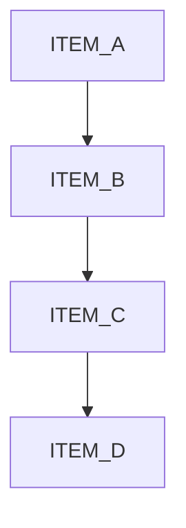

Sometimes, however, the items in a section are independent from each other.

If they do not depend on one another, executing them sequentially can unnecessarily increase the total execution time.

ETLX supports **section-level parallel execution** using:

```yaml
parallel: true
```

When enabled, the items belonging to that section are executed concurrently.

---

### Section Parallelism

Parallel execution applies to the **items inside the section**, not to the overall ETLX workflow.

Consider:

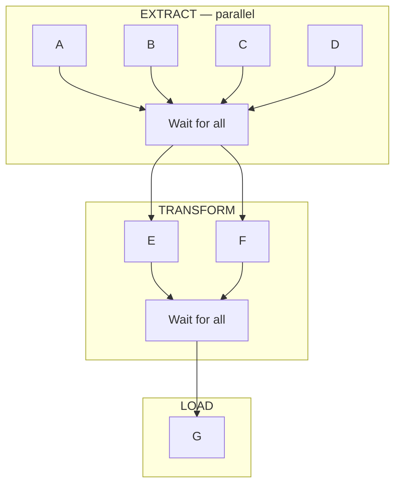

ETLX executes this as:

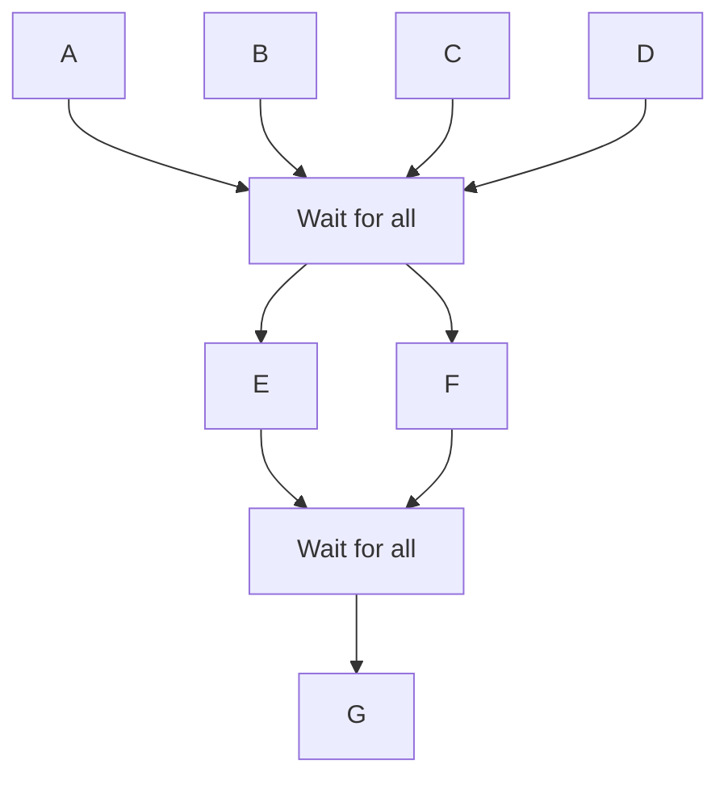

The sections themselves remain **sequential**.

ETLX will not start the next section until every item in the current parallel section has completed.

This makes parallel execution useful for creating controlled concurrency without turning the entire pipeline into an uncontrolled collection of goroutines.

---

### Enabling Parallel Execution

Add `parallel: true` to the section metadata:

````markdown
# PARALLEL

```yaml
name: PARALLEL
runs_as: ETL
description: Execute independent items concurrently.
parallel: true
active: true
```

## ...
````

Every ETL item inside this section can then execute concurrently.

For example:

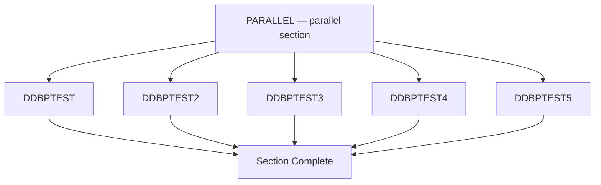

Instead of:

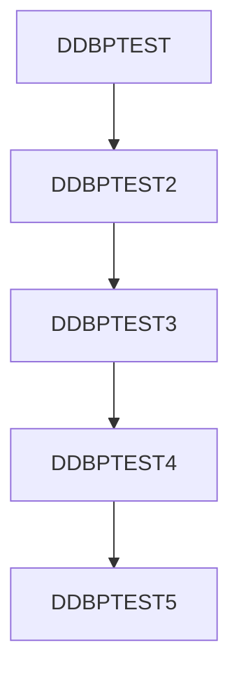

ETLX can execute:

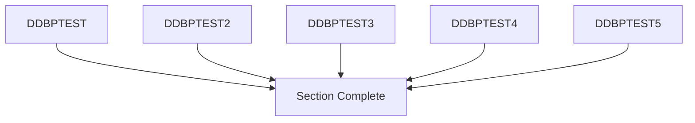

---

### Complete Example

The following example contains five independent DuckDB queries writing to a DuckLake database.

````markdown
# PARALLEL
```yaml metadata
name: PARALLEL
runs_as: ETL
description: Execute independent workloads concurrently.
connection: "duckdb:"
parallel: true
active: true
```

## DDBPTEST
```yaml metadata
name: DDBPTEST
description: Test query
table: DDBPTEST
load_conn: "duckdb:"
load_before_sql: |
  CREATE SECRET (
    TYPE quack,
    TOKEN 'super_secret_test_token'
  );
  ATTACH 'ducklake:quack:localhost' AS DB (DATA_PATH 'database/lake');
load_sql: |
  CREATE OR REPLACE TABLE DB."<table>" AS
  SELECT
      v1.x % 1000 AS category,
      COUNT(*) AS total,
      APPROX_COUNT_DISTINCT(v1.y) AS total_dups,
      AVG(v1.z) AS avg
  FROM (
      SELECT
          range AS x,
          random() AS y,
          random() * 100 AS z
      FROM range(100_000_000)
  ) v1
  JOIN (
      SELECT range AS id
      FROM range(5000)
  ) v2
    ON (v1.x % 5000) = v2.id
  GROUP BY category;
load_after_sql: "DETACH DB;"
active: true
```

## DDBPTEST2
```yaml metadata
name: DDBPTEST2
description: Test query
table: DDBPTEST2
load_conn: "duckdb:"
load_before_sql: |
  CREATE SECRET (
    TYPE quack,
    TOKEN 'super_secret_test_token'
  );
  ATTACH 'ducklake:quack:localhost'
    AS DB (DATA_PATH 'database/lake');
load_sql: |
  CREATE OR REPLACE TABLE DB."<table>" AS
  SELECT
      v1.x % 1000 AS category,
      COUNT(*) AS total,
      APPROX_COUNT_DISTINCT(v1.y) AS total_dups,
      AVG(v1.z) AS avg
  FROM (
      SELECT
          range AS x,
          random() AS y,
          random() * 100 AS z
      FROM range(10_000_000)
  ) v1
  JOIN (
      SELECT range AS id
      FROM range(5000)
  ) v2
    ON (v1.x % 5000) = v2.id
  GROUP BY category;
load_after_sql: "DETACH DB;"
active: true
```
...
````

All items are independent, so ETLX can execute them concurrently.

---

### The Next Section Still Waits

Consider a workflow with:

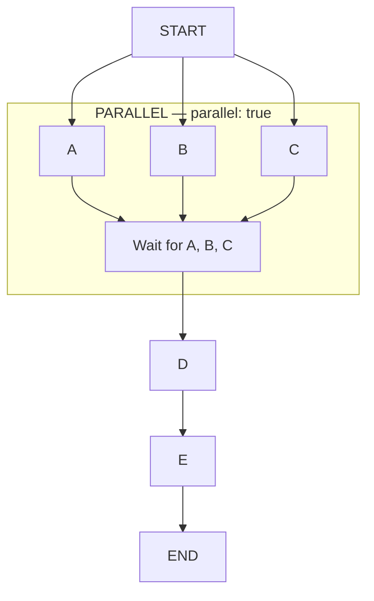

ETLX guarantees the section ordering:

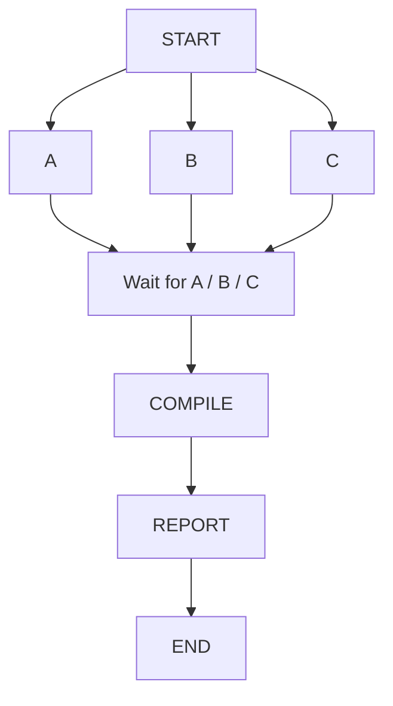

`D` will not start until `A`, `B`, and `C` have finished.

Likewise, `E` will not start until `D` has completed.

This means you can safely combine sequential and parallel sections in the same ETLX document.

---

### Parallel Execution Is Not Dependency Resolution

`parallel: true` should only be used when the items inside the section are independent.

For example, this is a good candidate:

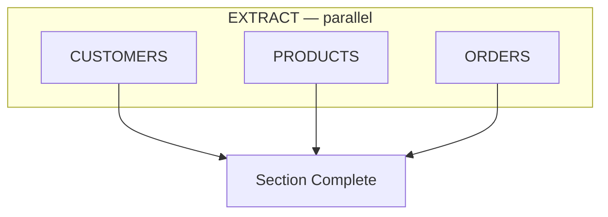

If none of the three items depends on the output of another item, they can execute concurrently.

This is **not** a good candidate:

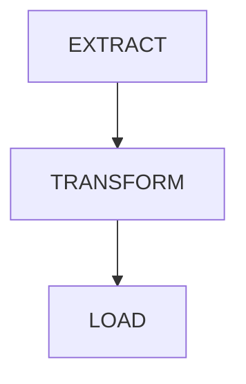

when:

```text
TRANSFORM → depends on EXTRACT

LOAD → depends on TRANSFORM
```

Those operations have an explicit dependency and should remain sequential.

Parallel sections therefore do not replace pipeline dependency design. They provide a way to tell ETLX that the items in a section are safe to execute concurrently.

---

### Database Considerations

Parallel execution should be used with care when multiple items write to the same database.

A common assumption is:

> "The items write to different tables, therefore they are safe to execute concurrently."

That is **not necessarily true**.

Some databases allow multiple concurrent writers, while others serialize writes or permit only a single writer at a time.

For example:

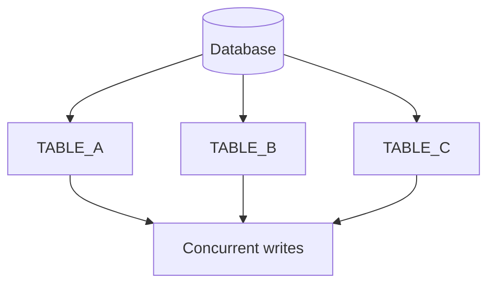

Even though the tables are different, the database itself may still require a single writer.

This can result in:

* Write contention
* Lock errors
* Busy/locked database errors
* Transaction conflicts
* Reduced performance
* Failed ETL items

Therefore, `parallel: true` should be enabled only when the underlying storage system can handle the expected concurrency.

---

### When Parallel Execution Is a Good Fit

Parallel execution is particularly useful when the workload consists of independent operations such as:

* Extracting multiple independent data sources
* Processing independent files
* Generating independent files
* Uploading objects to blob storage
* Downloading independent objects
* Running independent analytical queries
* Writing to storage systems designed for concurrent writers
* Processing different partitions of a dataset

For example:

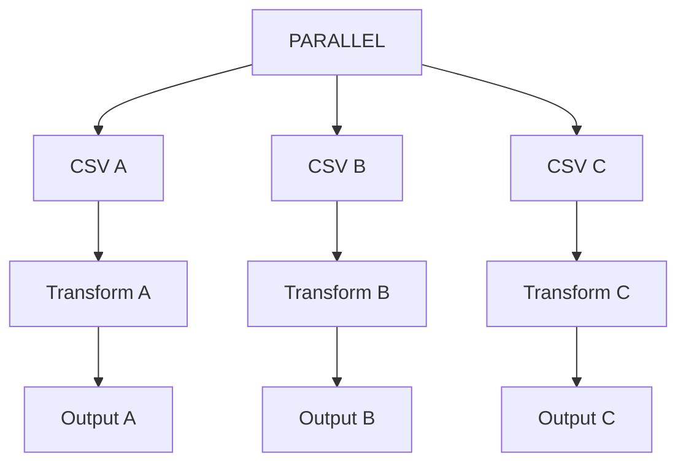

This type of workload can benefit significantly from concurrency.

---

### File and Blob Storage

Parallel execution can be particularly effective when the outputs are independent files or objects.

For example:

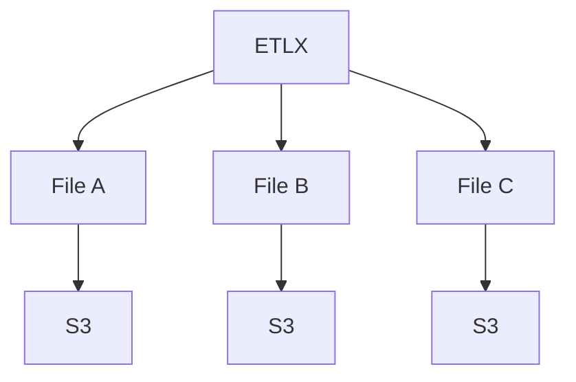

Each operation can work independently without requiring all writers to coordinate through a single database writer.

This makes parallel sections a good candidate for workloads involving:

* Amazon S3
* Azure Blob Storage
* Google Cloud Storage
* MinIO
* Data lakes
* Lakehouse storage
* Local file systems

The actual concurrency limits still depend on the storage system, network bandwidth, CPU, memory, and the resources available to the ETLX process.

---

### Resources Still Matter

Parallel execution does not create additional hardware resources.

If five workloads are executed concurrently, they still compete for:

* CPU
* Memory
* Disk I/O
* Network bandwidth
* Database connections
* Storage throughput

For example:

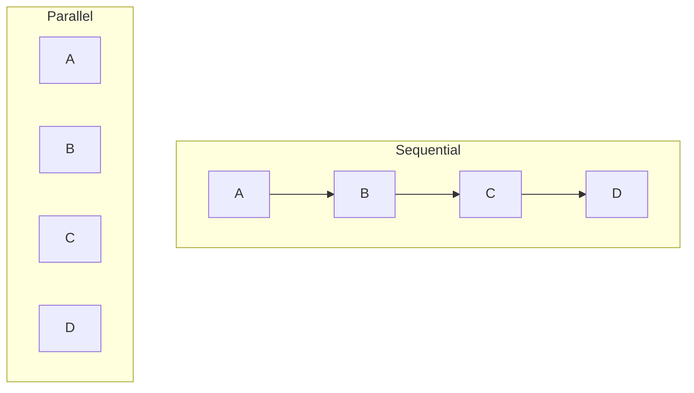

If the machine has enough available resources, the parallel version can be considerably faster.

If the machine is already resource constrained, running everything concurrently can make the entire workflow slower.

---

### Use With Caution

`parallel: true` is therefore an explicit performance optimization, not a guarantee that the workload will be faster.

Before enabling it, consider:

1. Are the items independent?
2. Can the target database handle concurrent writers?
3. Can the storage system handle concurrent operations?
4. Is there enough CPU?
5. Is there enough memory?
6. Is there enough disk I/O?
7. Is there enough network bandwidth?
8. Can the required number of database connections be opened safely?

If the answer to these questions is yes, parallel execution can significantly reduce total pipeline execution time.

---

### Sequential by Default

ETLX keeps the default behavior sequential.

Without:

```yaml
parallel: true
```

the section behaves normally:

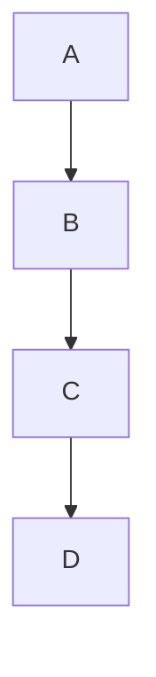

With:

```yaml
parallel: true
```

the items become concurrent:

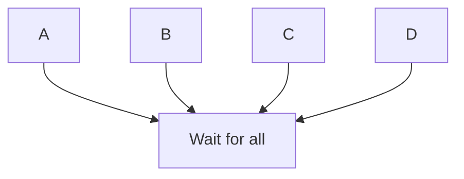

The next ETLX section still waits for all four items to complete.

This makes parallelism opt-in and allows existing ETLX documents to continue behaving exactly as before.

---

### Parallel Sections and Remote Execution

Parallel section execution and Remote Distributed Execution solve related but different problems.

**Parallel sections** execute concurrently within the same ETLX process:

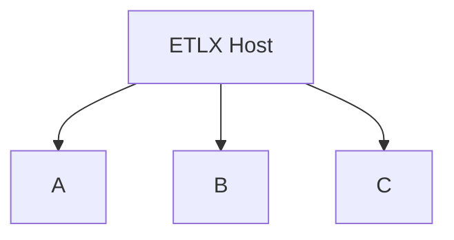

**Remote Distributed Execution** distributes execution across different machines:

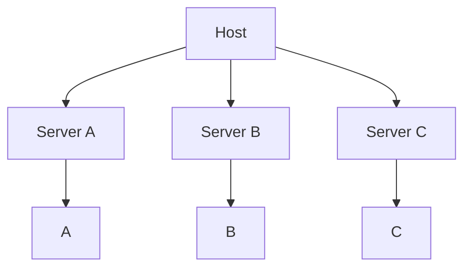

They can also be combined.

For example, a remote worker can execute a section where several independent items are themselves configured with:

```yaml
parallel: true
```

This provides two levels of concurrency:

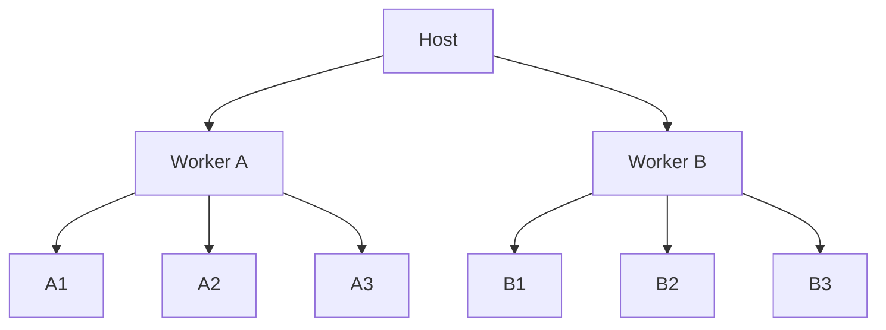

This should be used carefully because the total resource consumption can increase rapidly.

---

### The Goal

Parallel Section Execution gives ETLX a simple way to exploit concurrency without changing the overall structure of a pipeline.

The workflow remains sequential at the section level:

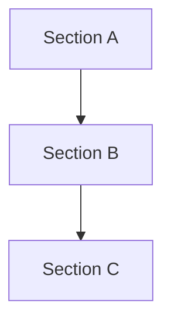

while individual sections can explicitly opt into concurrency:

```mermaid
flowchart TD
    A[Section A] --> B

    subgraph B["Section B — parallel"]
        B1[B1]
        B2[B2]
        B3[B3]

        WAIT[Wait for all]

        B1 --> WAIT
        B2 --> WAIT
        B3 --> WAIT
    end

    B --> C[Section C]
```

The principle is simple:

> **Keep the workflow sequential where dependencies exist, and use parallel sections where independent work can safely execute concurrently.**

When the storage system supports concurrent operations and the machine has sufficient resources, parallel execution can provide substantial performance improvements.

## When the storage system has a single-writer architecture or the workload is resource constrained, parallel execution should be used with caution.
